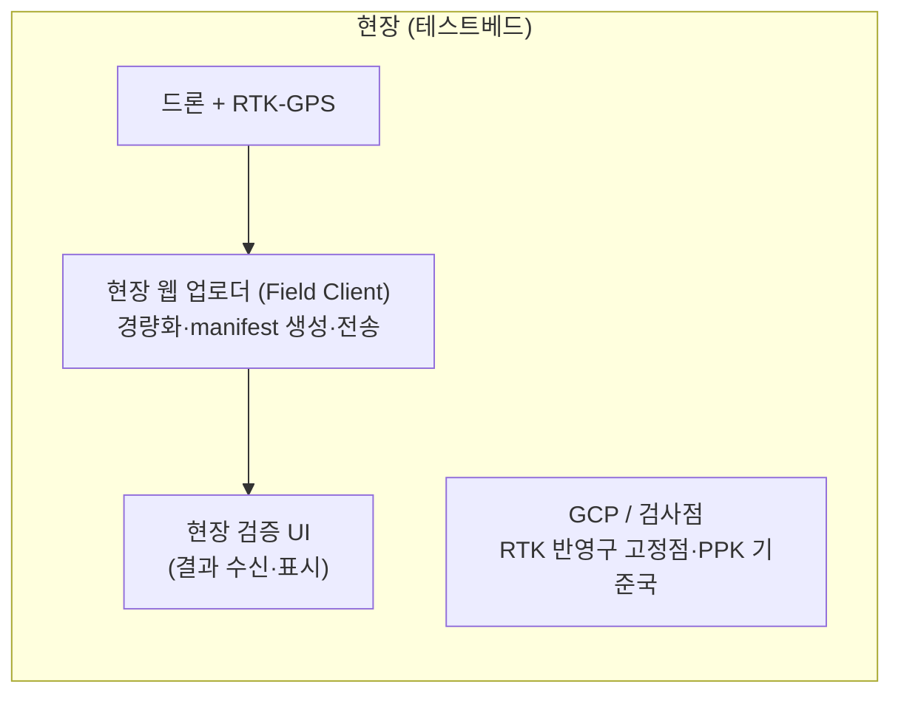

# Mermaid 테스트

```mermaid
flowchart LR
  subgraph FIELD["현장 (테스트베드)"]
    D["드론 + RTK-GPS"] --> GS["현장 웹 업로더 (Field Client)<br/>경량화·manifest 생성·전송"]
    GCP["GCP / 검사점<br/>RTK 반영구 고정점·PPK 기준국"]
    GS --> UI["현장 검증 UI<br/>(결과 수신·표시)"]
  end
```
